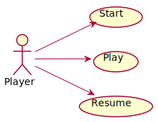
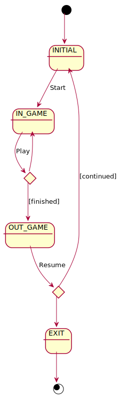
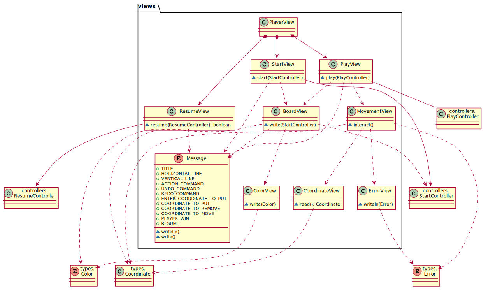

# TicTacToe. Requisitos Sencilla
Universo Santa Tecla  
[uSantaTecla@gmail.com](mailto:uSantaTecla@gmail.com)  
  
**Índice**

1. [Requisitos](#requisitos)  
2. [Vista de Casos de Uso](#vista-de-casos-de-uso)
2.1. [Vista de Caso de Uso Start](#vista-de-caso-de-uso-start)  
2.2. [Vista de Caso de Uso Propose](#vista-de-caso-de-uso-propose)  
2.3. [Vista de Caso de Uso Resume](#vista-de-caso-de-uso-resume)    
2.4. [Prototipo de Interfaz](#prototipo-de-interfaz)   
3. [Analisis](#analisis)  
3.1. [Casos de Uso](#casos-de-uso)  
3.1.1. [Analisis Start](#analisis-start)  
3.1.2. [Analisis Propose](#analisis-propose)  
3.1.3. [Analisis Resume](#analisis-resume)  
3.2. [Paquetes](#paquetes)  
3.2.1. [Vistas](#vistas)  
3.2.2. [Controladores](#controladores)  
3.2.3. [Modelos](#modelos)  
3.2.4. [Types](#types)  
  
## Requisitos  

| * _Funcionalidad: **Sencilla**_<br/>  * _Interfaz: **Texto**_<br/>  * _Distribución: **Standalone**_<br/>  * _Persistencia: **No**_<br/> |  | 
| :------- | :------: |  

## Vista de Casos de Uso  

| Diagrama de Actores y Casos de Uso | Diagrama de Contexto |
|---|---|
|  |  |  

## Vista de Caso de Uso Start  
  

## Vista de Caso de Uso Propose  
  

## Vista de Caso de Uso Resume  
  

### Prototipo de Interfaz
  
```
--- TIC TAC TOE ---
-------------
|   |   |   |
|   |   |   |
|   |   |   |
-------------
Enter a coordinate to put a token:
Row: 4
Column: -1
The coordinates are wrong
Enter a coordinate to put a token:
Row: 1
Column: 1
-------------
| X |   |   |
|   |   |   |
|   |   |   |
-------------
Enter a coordinate to put a token:
Row: 1
Column: 1
The square is not empty
Enter a coordinate to put a token:
Row: 1
Column: 2
-------------
| X | O |   |
|   |   |   |
|   |   |   |
-------------
Enter a coordinate to put a token:
Row: 2
Column: 2
-------------
| X | O |   |
|   | X |   |
|   |   |   |
-------------
Enter a coordinate to put a token:
Row: 3
Column: 3
-------------
| X | O |   |
|   | X |   |
|   |   | O |
-------------
Enter a coordinate to put a token:
Row: 1
Column: 3
-------------
| X | O | X |
|   | X |   |
|   |   | O |
-------------
Enter a coordinate to put a token:
Row: 3
Column: 1
-------------
| X | O | X |
|   | X |   |
| O |   | O |
-------------
Origin coordinate to move
Row: 3
Column: 1
There is not a token of yours
Origin coordinate to move
Row: 1
Column: 1
Target coordinate to move
Row: 1
Column: 1
The origin and target squares are the same
Target coordinate to move
Row: 3
The origin and target squares are the same
Target coordinate to move
Row: 3
Column: 1
The square is not empty
Target coordinate to move
Row: 3
Column: 2
-------------
|   | O | X |
|   | X |   |
| O | X | O |
-------------
Origin coordinate to move
Row: 1
Column: 2
Target coordinate to move
Row: 1
Column: 1
-------------
| O |   | X |
|   | X |   |
| O | X | O |
-------------
Origin coordinate to move
Row: 1
Column: 3
Target coordinate to move
Row: 1
Column: 2
-------------
| O | X |   |
|   | X |   |
| O | X | O |
-------------
X Player: You win!!! :-)
Do you want to continue? (y/n):
```
## Analisis  
  

## Casos de Uso  

### Analisis Start  
  

### Analisis Propose  
  

### Analisis Resume  
  

## Paquetes  

### Vistas  
  

### Controladores  
  

### Modelos  
  

### Types  