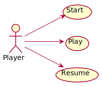

# TicTacToe. Requisitos Gráficos
Universo Santa Tecla  
[uSantaTecla@gmail.com](mailto:uSantaTecla@gmail.com)  
  
**Índice**

1. [Requisitos](#requisitos)  
2. [Vista de Casos de Uso](#vista-de-casos-de-uso)  
2.1. [Prototipo de Interfaz](#prototipo-de-interfaz)  
2.1.1. [Gráfica](#grfica)  
2.1.2. [Consola](#consola)  
2.1.2.1. [Número de jugadores: 0](#número-de-jugadores-0)  
2.1.2.2. [Número de jugadores: 1](#número-de-jugadores-1)  
2.1.2.3. [Número de jugadores: 2](#número-de-jugadores-2)  
  
## Requisitos  

| * _Funcionalidad: **Básica**_<br/>  * _Interfaz: **Gráfica y Texto**_<br/>  * _Distribución: **Standalone**_<br/>  * _Persistencia: **No**_<br/> |  | 
| :------- | :------: |  

## Vista de Casos de Uso  

| Diagrama de Actores y Casos de Uso | Diagrama de Contexto |
|---|---|
|  |  |  

### Prototipo de Interfaz  

#### Gráfica

| Pantallas | Diálogos |
|---|---|
|  |  |

#### Consola  
  
###### Número de jugadores: 0  

```
--- TIC TAC TOE ---
Number of user? [0, 2]: 0
-------------
|   |   |   | 
|   |   |   | 
|   |   |   | 
-------------
-------------
|   | X |   | 
|   |   |   | 
|   |   |   | 
-------------
-------------
|   | X |   | 
| O |   |   | 
|   |   |   | 
-------------
-------------
|   | X |   | 
| O |   |   | 
|   |   | X | 
-------------
-------------
|   | X |   | 
| O |   |   | 
|   | O | X | 
-------------
-------------
|   | X |   | 
| O |   |   | 
| X | O | X | 
-------------
-------------
|   | X |   | 
| O |   | O | 
| X | O | X | 
-------------
-------------
|   | X | X | 
| O |   | O | 
|   | O | X | 
-------------
-------------
| O | X | X | 
| O |   | O | 
|   |   | X | 
-------------
-------------
| O | X |   | 
| O | X | O | 
|   |   | X | 
-------------
-------------
| O | X |   | 
| O | X |   | 
|   | O | X | 
-------------
-------------
| O | X |   | 
| O |   |   | 
| X | O | X | 
-------------
-------------
|   | X |   | 
| O |   | O | 
| X | O | X | 
-------------
-------------
|   | X | X | 
| O |   | O | 
|   | O | X | 
-------------
-------------
|   | X | X | 
| O |   | O | 
| O |   | X | 
-------------
-------------
|   | X |   | 
| O | X | O | 
| O |   | X | 
-------------
-------------
|   | X |   | 
| O | X |   | 
| O | O | X | 
-------------
-------------
| X |   |   | 
| O | X |   | 
| O | O | X | 
-------------
X Player: You win!!! :-)
Do you want to continue? (y/n):
```  

##### Número de jugadores: 1  

```
--- TIC TAC TOE ---
Number of user? [0, 2]: 1
-------------
|   |   |   | 
|   |   |   | 
|   |   |   | 
-------------
Coordinate to put
Row: 1
Column: 1
-------------
| X |   |   | 
|   |   |   | 
|   |   |   | 
-------------
-------------
| X |   |   | 
|   |   |   | 
| O |   |   | 
-------------
Coordinate to put
Row: 2
Column: 2
-------------
| X |   |   | 
|   | X |   | 
| O |   |   | 
-------------
-------------
| X |   |   | 
|   | X |   | 
| O |   | O | 
-------------
Coordinate to put
Row: 1
Column: 2
-------------
| X | X |   | 
|   | X |   | 
| O |   | O | 
-------------
-------------
| X | X |   | 
|   | X |   | 
| O | O | O | 
-------------
O Player: You win!!! :-)
```  

##### Número de jugadores: 2
  
```
--- TIC TAC TOE ---
Number of user? [0, 2]: 2
-------------
|   |   |   | 
|   |   |   | 
|   |   |   | 
-------------
Coordinate to put
Row: 1
Column: 1
-------------
| X |   |   | 
|   |   |   | 
|   |   |   | 
-------------
Coordinate to put
Row: 3
Column: 2
-------------
| X |   |   | 
|   |   |   | 
|   | O |   | 
-------------
Coordinate to put
Row: 1
Column: 2
-------------
| X | X |   | 
|   |   |   | 
|   | O |   | 
-------------
Coordinate to put
Row: 3
Column: 3
-------------
| X | X |   | 
|   |   |   | 
|   | O | O | 
-------------
Coordinate to put
Row: 1
Column: 3
-------------
| X | X | X | 
|   |   |   | 
|   | O | O | 
-------------
X Player: You win!!! :-)
Do you want to continue? (y/n):
```
