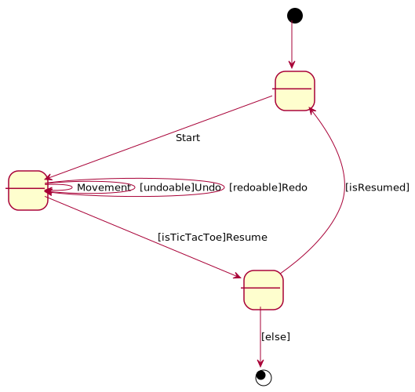

# TicTacToe. Requisitos Gráficos
Universo Santa Tecla  
[uSantaTecla@gmail.com](mailto:uSantaTecla@gmail.com)  
  
**Índice**

1. [Requisitos](#requisitos)  
2. [Vista de Casos de Uso](#vista-de-casos-de-uso)  
2.1. [Prototipo de Interfaz](#prototipo-de-interfaz)  
2.1.1. [Consola](#consola)  
  
## Requisitos  

| * _Funcionalidad: **Básica + Undo/Redo**_<br/>  * _Interfaz: **Gráfica y Texto**_<br/>  * _Distribución: **Standalone**_<br/>  * _Persistencia: **No**_<br/> |  | 
| :------- | :------: |  

## Vista de Casos de Uso  

| Diagrama de Actores y Casos de Uso | Diagrama de Contexto |
|---|---|
|  |  |  

### Prototipo de Interfaz  

#### Consola  

```
--- TIC TAC TOE ---
Number of user? [0, 2]: 1
-------------
|   |   |   | 
|   |   |   | 
|   |   |   | 
-------------

1) Do a action
Option? [1-1]: 1
Coordinate to put
Row: 1
Column: 1
-------------
| X |   |   | 
|   |   |   | 
|   |   |   | 
-------------
-------------
| X |   |   | 
|   |   |   | 
|   | O |   | 
-------------

1) Do a action
2) Undo previous action
Option? [1-2]: 1
Coordinate to put
Row: 1
Column: 2
-------------
| X | X |   | 
|   |   |   | 
|   | O |   | 
-------------
-------------
| X | X |   | 
|   | O |   | 
|   | O |   | 
-------------

1) Do a action
2) Undo previous action
Option? [1-2]: 2
-------------
| X |   |   | 
|   |   |   | 
|   | O |   | 
-------------

1) Do a action
2) Undo previous action
3) Redo previous action
Option? [1-3]: 3
-------------
| X | X |   | 
|   |   |   | 
|   | O |   | 
-------------
-------------
| X | X |   | 
|   | O |   | 
|   | O |   | 
-------------

1) Do a action
2) Undo previous action
Option? [1-2]: 1
Coordinate to put
Row: 1
Column: 3
X Player: You win!!! :-)
-------------
| X | X | X | 
|   | O |   | 
|   | O |   | 
-------------
Do you want to continue? (y/n):
```
