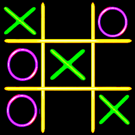
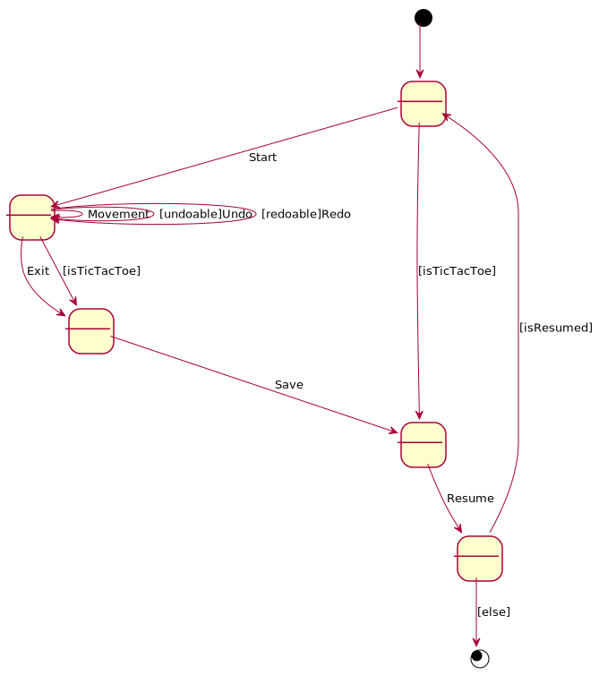

# TicTacToe. Requisitos Ficheros
Universo Santa Tecla  
[uSantaTecla@gmail.com](mailto:uSantaTecla@gmail.com)  
  
**Índice**

1. [Requisitos](#requisitos)  
2. [Vista de Casos de Uso](#vista-de-casos-de-uso)  
2.1. [Prototipo de Interfaz](#prototipo-de-interfaz)  
  
## Requisitos  

| * _Funcionalidad: **Básica + Undo/Redo**_<br/>  * _Interfaz: **Gráfica y Texto**_<br/>  * _Distribución: **Standalone + Client/Server**_<br/>  * _Persistencia: **Ficheros**_<br/> |  | 
| :------- | :------: |  

## Vista de Casos de Uso  

| Diagrama de Actores y Casos de Uso | Diagrama de Contexto |
|---|---|
|  |  |  

### Prototipo de Interfaz  

```
-------------------- TIC TAC TOE --------------------
----- Choose one option -----
1) Start a new game
2) Open a saved game
1
Number of users [0-2] 1
----- Choose one option -----
1) Do a movement
2) Exit game
1
-----------------------------------------------------
| - | - | - |
| - | - | - |
| - | - | - | 
-----------------------------------------------------
Enter a coordinate to put a token:
Row: 1
Column: 1
-----------------------------------------------------
| X | - | - |
| - | - | - |
| - | - | - |
-----------------------------------------------------
----- Choose one option -----
1) Do a movement
2) Undo previous movement
3) Exit game
1
-----------------------------------------------------
| X | - | - |
| - | - | - |
| - | - | - |
-----------------------------------------------------
-----------------------------------------------------
| X | - | O |
| - | - | - |
| - | - | - | 
-----------------------------------------------------
----- Choose one option -----
1) Do a movement
2) Undo previous movement
3) Exit game
1
-----------------------------------------------------
| X | - | O |
| - | - | - |
| - | - | - |
-----------------------------------------------------
Enter a coordinate to put a token:
Row: 2
Column: 1
-----------------------------------------------------
| X | - | O |
| X | - | - | 
| - | - | - |
-----------------------------------------------------
----- Choose one option -----
1) Do a movement
2) Undo previous movement
3) Exit game
1
-----------------------------------------------------
| X | - | O |
| X | - | - |
| - | - | - |
-----------------------------------------------------
-----------------------------------------------------
| X | - | O |
| X | - | O |
| - | - | - |
-----------------------------------------------------
----- Choose one option -----
1) Do a movement
2) Undo previous movement
3) Exit game
3
Do you want to save the game?? (y/n): y
Name: juego2


--- TIC TAC TOE ---
----- Choose one option -----
1. Start a new game
2. Open a saved game
2
----- Choose one option -----
1. juego1.mm
2. juego2.mm
2
juego2.mm
----- Choose one option -----
1. Do a movement
2. Exit game
1
| X | - | O |
X	-	O
Enter a coordinate to put a token:
Row: 1
Column: 4
The coordinates are wrong
Enter a coordinate to put a token:
Row: 3
Column: 1
| X | - | O |
| X | - | O |
| X | - | - |
Do you want to save the game?? (y/n): n
X Player: You win!!! :-)
```
