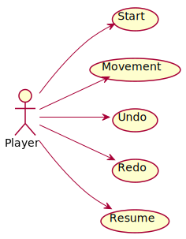
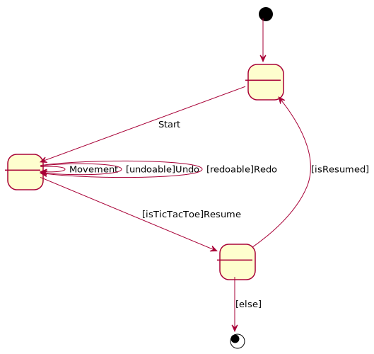

# TicTacToe. Requisitos Gráficos
Universo Santa Tecla  
[uSantaTecla@gmail.com](mailto:uSantaTecla@gmail.com)  
  
**Índice**

1. [Requisitos](#requisitos)  
2. [Vista de Casos de Uso](#vista-de-casos-de-uso)  
2.1. [Prototipo de Interfaz](#prototipo-de-interfaz)  
2.1.1. [Consola](#consola)  
  
## Requisitos  

| * _Funcionalidad: **Básica + undo/redo**_   * _Interfaz: **Gráfica y Texto**_   * _Distribución: **Standalone**_   * _Persistencia: **No**_  |  | 
| :------- | :------: |  

## Vista de Casos de Uso  

| Diagrama de Actores y Casos de Uso | Diagrama de Contexto |
|---|---|
|  |  |  

### Prototipo de Interfaz  

#### Consola
